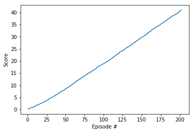

# Report Project 2: Continuous Control

### Introduction
In this project we implemented the [Continuous Control with Deep Reinforcement Learning](https://arxiv.org/pdf/1509.02971.pdf) paper (Lillicrap et al)[1], that present a model-free, off-policy actor-critic algorithm using deep function approximators that can learn policies in high-dimensional, continuous action spaces known as Deep Deterministic Policy Gradients (DDPG).

The DDPG implementation was used to solve the [Reacher](https://github.com/Unity-Technologies/ml-agents/blob/master/docs/Learning-Environment-Examples.md#reacher) environment[2], an environment that provides a double-jointed arm that can move to target locations. For this specific environment a total of 20 double-jointed arm was provided.

### Learning Algorithm
DDPG has been implemented in the files, based on the [solution](https://github.com/udacity/deep-reinforcement-learning/blob/55474449a112fa72323f484c4b7a498c8dc84be1/ddpg-bipedal) of the bipedal environment made by [Udacity](https://www.udacity.com) for the [Deep Reinforcement Learning NanoDegree](https://eu.udacity.com/course/deep-reinforcement-learning-nanodegree--nd893):

    ddpg_agent.py - contains the implementation of the agent and hyperparameters
    model.py - Contains the implementation of the Actor and Critic

Hyperparameters can be adjusted, by default the following has been used:

    BUFFER_SIZE = int(1e6)  # replay buffer size
    BATCH_SIZE = 64         # minibatch size
    GAMMA = 0.99            # discount factor
    TAU = 1e-3              # for soft update of target parameters
    LR_ACTOR = 1e-4         # learning rate of the actor 
    LR_CRITIC = 3e-4        # learning rate of the critic
    WEIGHT_DECAY = 0.0001   # L2 weight decay

The architectures are fully connected neural networks with following dimensions:

    - Actor: 256 -> 256
    - Critic: 256 -> 256 -> 128

### Results and Plot of Rewards
By executing the instructions in `Continuous_Control.ipynb` we were able to get the agent to be able to solve the task, of getting an average score of at least +30 in last 100 episodes, in 202 episodes with an average score of 30.21.

here is graph of increase of score over time (number of episodes):

### Ideas for future work
The linearity of the improvements of scores over time gives an idea that it should be able to improve the training of the agent. Some ideas can be:

- Hyperparameters tunning
- Channing the Actor and Critics neural network architecture

Probably those can give some smaller improvement of performance. Instead a better option should be consider an alternative algorithms 

- Implement another algorithm that is more suitable to the environment of having 20 double-jointed arm to train in parallel as in the case of like [PPO](https://arxiv.org/pdf/1707.06347.pdf), [A3C](https://arxiv.org/pdf/1602.01783.pdf), and [D4PG](https://openreview.net/pdf?id=SyZipzbCb) 
 

### References

[1][Continuous Control with Deep Reinforcement Learning](https://arxiv.org/pdf/1509.02971.pdf) paper (Lillicrap et al)

[2][Unity Reacher Environment](https://github.com/Unity-Technologies/ml-agents/blob/master/docs/Learning-Environment-Examples.md#reacher)
